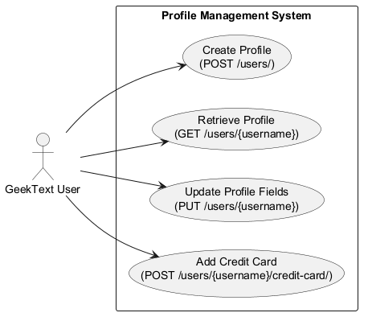
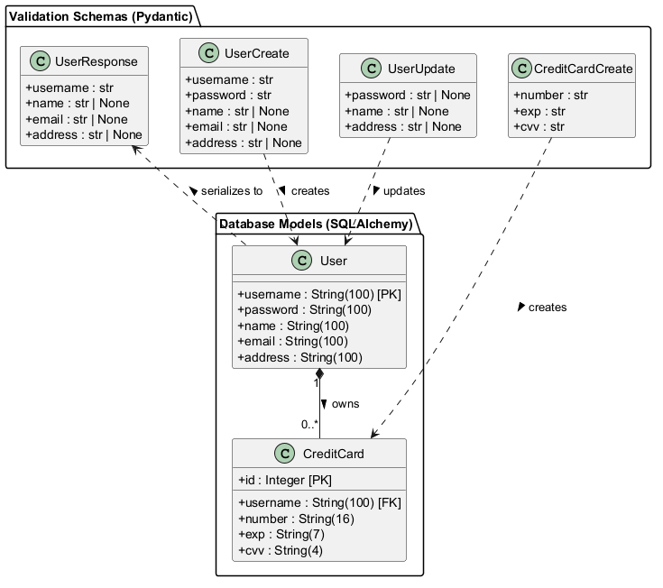
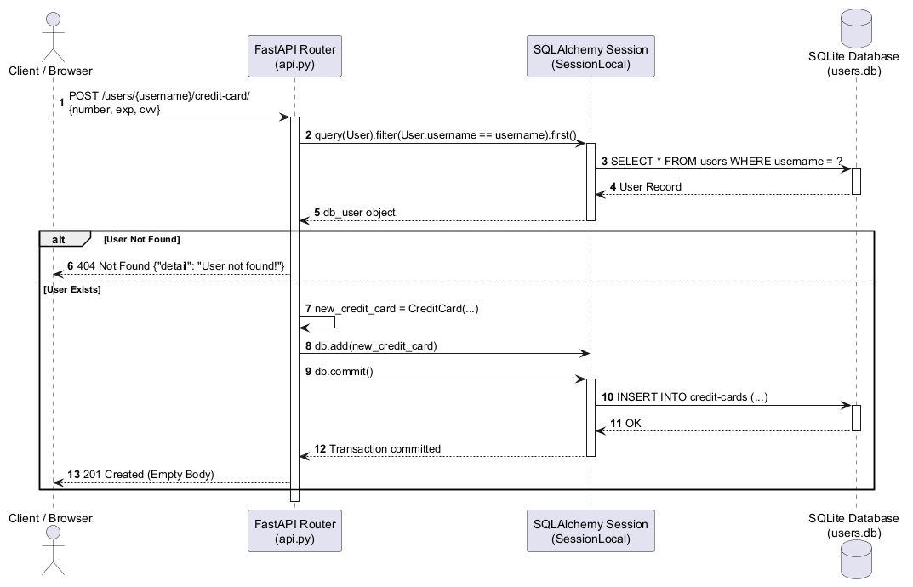
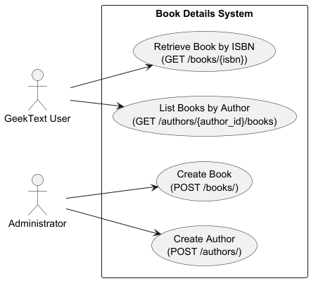
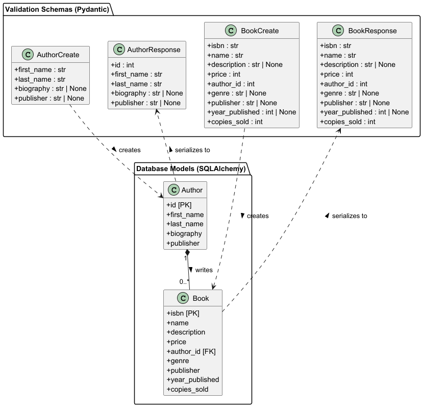
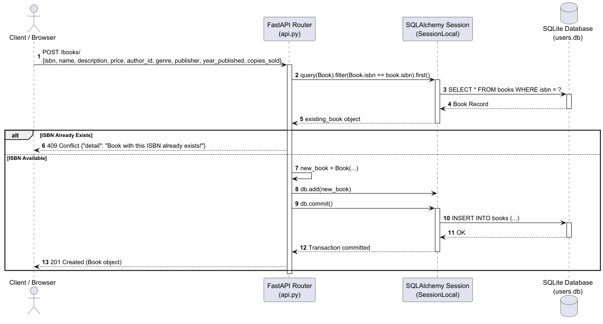

# Feature 2: Profile Management API

Owner: Marcos

Branch: `profile-management`


## Overview
Implements backend for user registration, user profile retrieval, partial profile updates, and credit card association using FastAPI, SQLAlchemy, and SQLite.

## Implemented Endpoints

| Method | Endpoint | Description | Status Code |
| :--- | :--- | :--- | :--- |
| `POST` | `/users/` | Create a new user profile | 201 Created / 409 Conflict |
| `GET` | `/users/{username}` | Retrieve user profile by username | 200 OK / 404 Not Found |
| `PUT` | `/users/{username}` | Update name, password, or address | 204 No Content / 404 Not Found |
| `POST` | `/users/{username}/credit-card/` | Associate a credit card to a user | 201 Created / 404 Not Found |

## UML Diagrams

### Use Case Diagram


### Class Diagram


### Sequence Diagram



# Feature 4: Book Details API

Owner: Will

Branch: `book-details`


## Overview
Implements backend for book creation, book retrieval by ISBN, author creation, and querying books by author using FastAPI, SQLAlchemy, and SQLite.

## Implemented Endpoints

| Method | Endpoint | Description | Status Code |
| :--- | :--- | :--- | :--- |
| `POST` | `/books/` | Create a new book | 201 Created / 409 Conflict |
| `GET` | `/books/{isbn}` | Retrieve book details by ISBN | 200 OK / 404 Not Found |
| `POST` | `/authors/` | Create a new author | 201 Created |
| `GET` | `/authors/{author_id}/books` | Retrieve all books by an author | 200 OK / 404 Not Found |

## UML Diagrams

### Use Case Diagram


### Class Diagram


### Sequence Diagram



## How to Run & Verify

1. Activate your virtual environment and install dependencies.
2. Start the local development server:
```bash
   uvicorn api.api:app --reload
```
